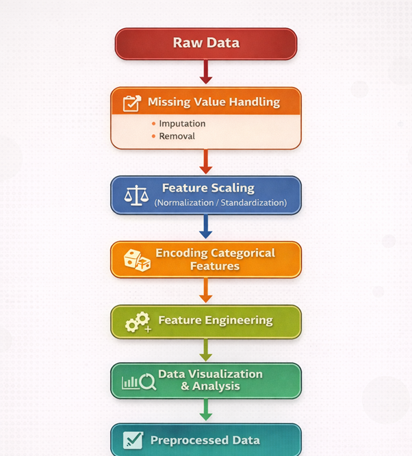

In machine learning, raw data obtained from real-world sources is rarely suitable for direct use in algorithms. Such data often contains missing values, inconsistent feature scales, noise, and categorical variables that models cannot process directly. Data preprocessing is therefore a crucial step that involves cleaning, transforming, and organizing the dataset so that it becomes consistent and suitable for learning. Along with preprocessing, feature engineering helps in improving model performance by creating meaningful features that better represent underlying patterns in the data.

### 1. Handling Missing Data
Missing data occurs when values are absent for certain attributes in a dataset and is a common challenge in real-world data analysis. Missing values may arise due to data collection errors, incomplete observations, system failures, or random occurrences. If left untreated, missing data can distort statistical analysis and negatively affect the performance of machine learning models. To address this issue, missing values are first identified and analyzed. Numerical attributes are commonly handled using statistical imputation techniques such as mean or median substitution, while categorical attributes are often filled using the most frequent category. In cases where an attribute contains an excessive number of missing values, it may be removed to maintain data reliability. Proper handling of missing data ensures dataset completeness and consistency before further processing.

### 2. Normalization
Normalization is a preprocessing technique used to rescale numerical features so that they lie within a comparable range. In many datasets, numerical attributes may have significantly different scales, which can cause learning algorithms to be biased toward features with larger magnitudes. Normalization addresses this issue by transforming feature values using scaling techniques such as min–max normalization or standardization. This process improves numerical stability, speeds up model convergence, and ensures that all numerical features contribute equally to the learning process.

Min-max normalization (usually called feature scaling) performs a linear transformation on the original data. This technique gets all the scaled data in the range [0,1]. The formula to achieve this is the following:

    <strong>xscaled = </strong>
    

        
x &minus; xmin

        
xmax &minus; xmin

    

Min-max normalization preserves the relationships among the original data values. The cost of having this bounded range is that we will end up with smaller standard deviations, which can suppress the effect of outliers.

### 3. Categorical Encoding
Many real-world datasets contain categorical variables represented as text or labels, whereas most machine learning algorithms require numerical input. Categorical encoding is the process of converting categorical data into numerical representations without losing meaningful information. Common encoding techniques include:
- **One-hot encoding**: Converts each category into binary variables (0/1) indicating presence or absence. K−1 dummy variables are used to avoid multicollinearity.
- **Ordinal / Label encoding**: Assigns integer values to categories based on their natural order. Should be used only when an inherent ranking exists. when categories have a natural order.
- **Count / Frequency encoding**: Replaces each category with its count or frequency in the dataset. Assumes that category popularity is predictive of the target.

### 4. Feature Engineering
Feature engineering involves creating new features or transforming existing ones to better capture underlying patterns in the data. Rather than relying solely on raw attributes, engineered features can represent domain knowledge and relationships more effectively. Feature engineering can include combining multiple attributes, deriving indicator variables, or generating new features based on existing data. This process enhances the expressive power of the dataset and can significantly improve model accuracy and generalization.

### 5. Data Visualization
Data visualization is an important analytical step used to visually explore and understand the characteristics of a dataset. Visualization techniques help reveal patterns, trends, distributions, and potential anomalies in the data. Univariate visualizations are used to analyze individual feature distributions, while bivariate visualizations help study relationships between pairs of variables. Visualization also aids in validating preprocessing steps such as normalization and encoding, ensuring that transformations have been applied correctly.

The figure below illustrates the pipeline of the experiment, showing the sequence of steps involved in data preprocessing and feature engineering, starting from raw data and resulting in preprocessed data ready for machine learning models:

    
     

