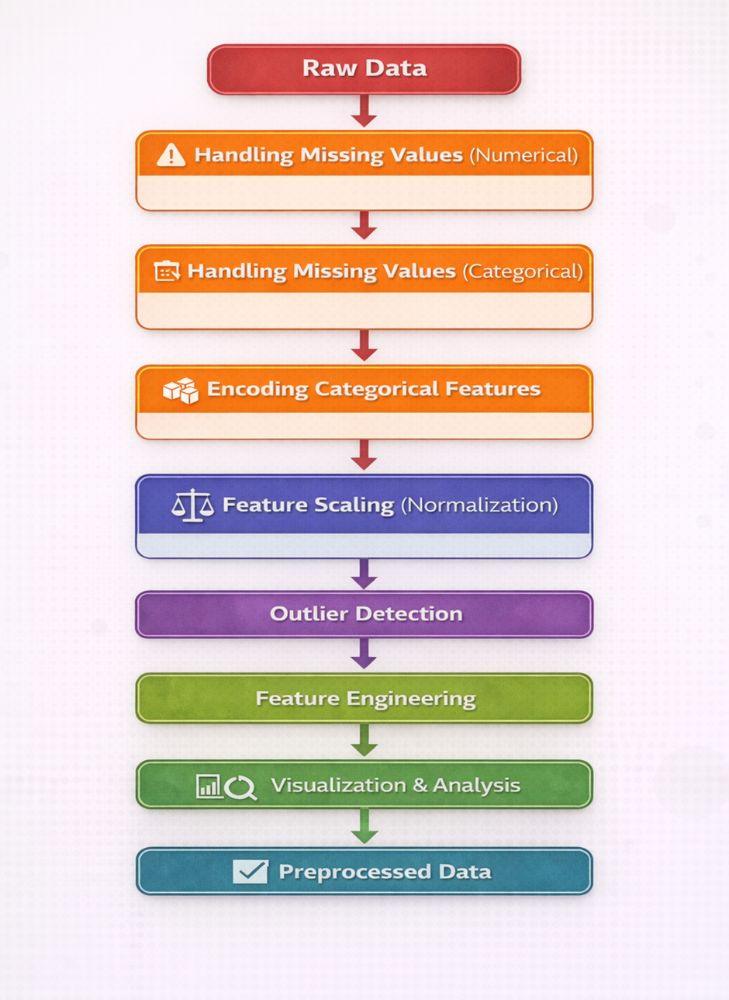

### 1. Data Preprocessing
In machine learning, raw datasets collected from real-world environments often contain inconsistencies such as missing values, categorical attributes, noisy data, and varying feature scales. These issues can significantly affect the performance and reliability of machine learning algorithms.

Data preprocessing is therefore a fundamental step that involves cleaning, transforming, and organizing the dataset before it is used for analysis or model training. Proper preprocessing ensures that the dataset is complete, consistent, and structured in a way that allows machine learning algorithms to learn meaningful patterns from the data.

### 2. Handling Missing Values (Numerical Features)
Missing values occur when observations for certain attributes are absent in a dataset. This may happen due to incomplete data collection, measurement errors, or system failures. Numerical attributes such as age, fare, or income frequently contain missing values that must be addressed before analysis.
Several statistical imputation techniques are commonly used to replace missing numerical values.

**Mean Imputation** replaces missing values with the average value of the feature. If a numerical attribute X contains missing values, the mean value is calculated as:

    
        <i>x</i> = 
        

            
1

            
<i>n</i>

        

        

            
<i>n</i>

            
Σ

            
<i>i</i>=1

        

        <i>xi</i>
    

The missing values are then replaced with <i>x</i>.

**Median Imputation** replaces missing values with the median of the feature, which represents the middle value when the data is sorted. This approach is particularly useful when the data distribution is skewed or contains outliers.

**Mode Imputation** replaces missing values with the most frequently occurring value in the feature. Although more common for categorical attributes, it can also be used for numerical variables with repeated values.

**Constant Imputation** replaces missing values with a fixed constant such as zero or another predefined value. This approach is sometimes used when missing values need to be represented explicitly.

Handling numerical missing values ensures that machine learning algorithms receive complete data without introducing bias or distortion in the dataset.

### 3. Handling Missing Values (Categorical Features)
Categorical attributes represent qualitative information such as labels, names, or categories. Missing values in categorical variables are commonly handled using most frequent value imputation, also known as mode imputation.

In this technique, the missing values are replaced with the category that appears most frequently in the dataset. This method helps preserve the distribution of categorical values while maintaining the consistency of the dataset.

For example, if the most frequent value in the “Embarked” column is “S”, all missing entries in that column can be replaced with “S”. This approach ensures that the dataset remains logically consistent without introducing new artificial categories.

### 4. Encoding Categorical Features
Many machine learning algorithms require numerical input and cannot process textual categorical values directly. Categorical encoding converts categorical variables into numerical representations while preserving their meaningful structure.

Several encoding techniques are commonly used.

**Label Encoding** assigns a unique integer value to each category. For example:

| Category | Encoded Value |
| :--- | :--- |
| Male | 0 |
| Female | 1 |

This technique is commonly used for binary categorical variables.

**One-Hot Encoding** converts each category into a separate binary feature. For example, if a variable has categories A, B, and C, it is transformed into three separate columns where each column indicates whether a particular category is present or not.

| A | B | C |
| :--- | :--- | :--- |
| True | False | False |
| False | True | False |
| False | False | True |

In this representation, True indicates the presence of a category, while False indicates its absence. This method ensures that no artificial ordering is introduced between categories. One-Hot Encoding is particularly suitable for nominal variables, where the categories do not have any inherent ranking or order.

**Ordinal Encoding** is used when categories have a natural ranking. Categories are assigned numerical values based on their relative order. For example:

| Pclass | Encoded |
| :--- | :--- |
| 1 | 0 |
| 2 | 1 |
| 3 | 2 |

This encoding preserves the hierarchical relationship between categories.

Selecting the correct encoding technique ensures that categorical features are represented accurately without introducing misleading relationships.

### 5. Feature Scaling and Normalization
In many datasets, numerical features have significantly different ranges. Machine learning algorithms that rely on distance calculations can become biased toward features with larger magnitudes. Feature scaling addresses this issue by transforming numerical features into comparable ranges.
Three common scaling techniques are used.

#### Min-Max Scaling
Min-Max scaling rescales data into a fixed range, typically between 0 and 1. The transformation is performed using the formula:

    
        <i>X</i>scaled = 
        

            
<i>X</i> − <i>X</i>min

            
<i>X</i>max − <i>X</i>min

        

    

where,
- *X* : original value
- *Xmin* : minimum value of the feature
- *Xmax* : maximum value of the feature

This method preserves the relationships among original data values but may be sensitive to outliers.

#### Standard Scaling (Standardization)
Standard scaling transforms the dataset so that the feature has a mean of zero and a standard deviation of one.
The transformation is given by:

    
        <i>Z</i> = 
        

            
<i>X</i> − <i>μ</i>

            
<i>σ</i>

        

    

where:
- *X* : original value
- *μ* : mean of the feature
- *σ* : standard deviation

Standardization is widely used when data follows an approximately normal distribution.

#### Robust Scaling
Robust scaling is designed to handle datasets containing extreme values or outliers. Instead of using the mean and standard deviation, it uses the median and the interquartile range (IQR).
The transformation is defined as:

    
        <i>X</i>scaled = 
        

            
<i>X</i> − Median

            
IQR

        

    

where,

    
        IQR = <i>Q</i>3 − <i>Q</i>1
    

This method is less affected by extreme values and is suitable for datasets containing significant outliers.

### 6. Outlier Detection
Outliers are observations that significantly deviate from the majority of data points in a dataset. These extreme values can distort statistical analysis and negatively impact machine learning models.
Two commonly used techniques for detecting outliers are the Z-Score method and the Interquartile Range (IQR) method.

#### Z-Score Method
The Z-Score measures how many standard deviations a data point lies from the mean of the dataset.
The formula for the Z-Score is:

    
        <i>Z</i> = 
        

            
<i>X</i> − <i>μ</i>

            
<i>σ</i>

        

    

where:
- *X* : observed value
- *μ* : mean of the dataset
- *σ* : standard deviation

Typically, any value with a Z-Score greater than ±3 is considered an outlier.

#### Interquartile Range (IQR) Method
The IQR method is based on the concept of quartiles, which divide the dataset into four equal parts.
- **<i>Q</i>1 (First Quartile)** → 25th percentile
- **<i>Q</i>2 (Median)** → 50th percentile
- **<i>Q</i>3 (Third Quartile)** → 75th percentile

The interquartile range is defined as:

    
        IQR = <i>Q</i>3 − <i>Q</i>1
    

Outliers are identified using the following boundaries:

    
        Lower Bound = <i>Q</i>1 − 1.5 × IQR
    

    
        Upper Bound = <i>Q</i>3 + 1.5 × IQR
    

Values outside this range are considered potential outliers.
The IQR method is robust because it relies on quartiles rather than the mean, making it less sensitive to extreme values.

### 7. Feature Engineering
Feature engineering is the process of transforming existing attributes or creating new features from the available data in order to better represent the underlying patterns within a dataset. Instead of relying solely on raw variables, feature engineering helps improve the quality and relevance of the input features used by machine learning algorithms.

Feature engineering may involve combining multiple attributes, deriving new variables from existing features, or transforming attributes into more meaningful representations. By capturing relationships between different variables, engineered features can provide additional contextual information that may not be directly available in the original dataset.

For example, multiple related attributes describing similar characteristics can be combined to form a single informative feature that summarizes their combined effect. Such transformations help simplify the dataset while preserving important information.

Effective feature engineering enhances the expressive power of the dataset and allows machine learning models to identify meaningful patterns more accurately. As a result, well-designed engineered features often lead to improved model performance, better interpretability, and more reliable predictions.

### 8. Data Visualization
Data visualization plays an important role in exploratory data analysis by providing graphical representations of data. Visual techniques help identify patterns, trends, distributions, and anomalies within the dataset.

Univariate visualizations analyze the distribution of individual features, while bivariate visualizations help examine relationships between pairs of variables.
Visualization also helps validate preprocessing steps such as normalization, encoding, and outlier detection. By observing changes in distributions and patterns, analysts can confirm that preprocessing techniques have been applied correctly.

Through intuitive graphical representations, visualization enables a deeper understanding of the dataset and supports better decision-making throughout the machine learning workflow.

 
<strong>Figure 1: End-to-End Data Preprocessing and Feature Engineering Pipeline.</strong>

The figure 1 illustrates the pipeline of the experiment, showing the sequence of steps involved in data preprocessing and feature engineering, starting from raw data and resulting in preprocessed data ready for machine learning models.